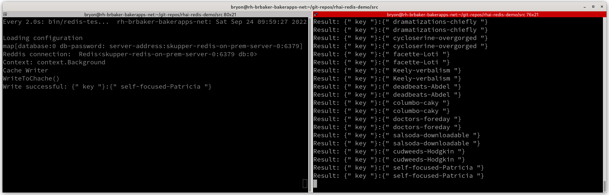
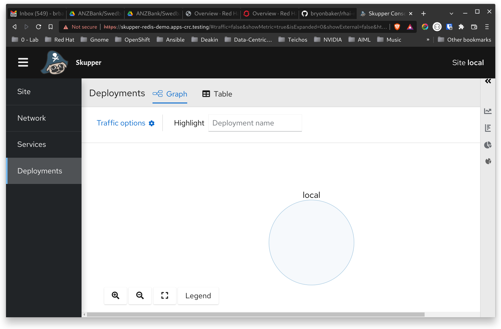
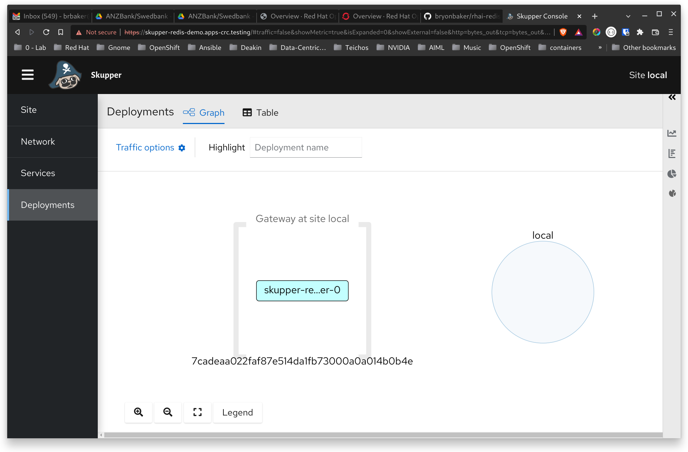
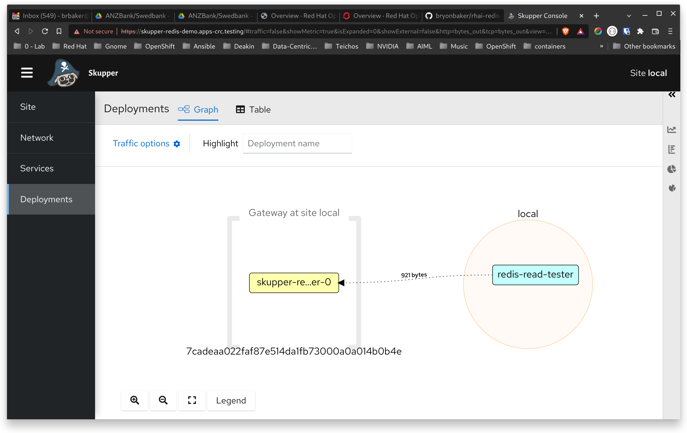
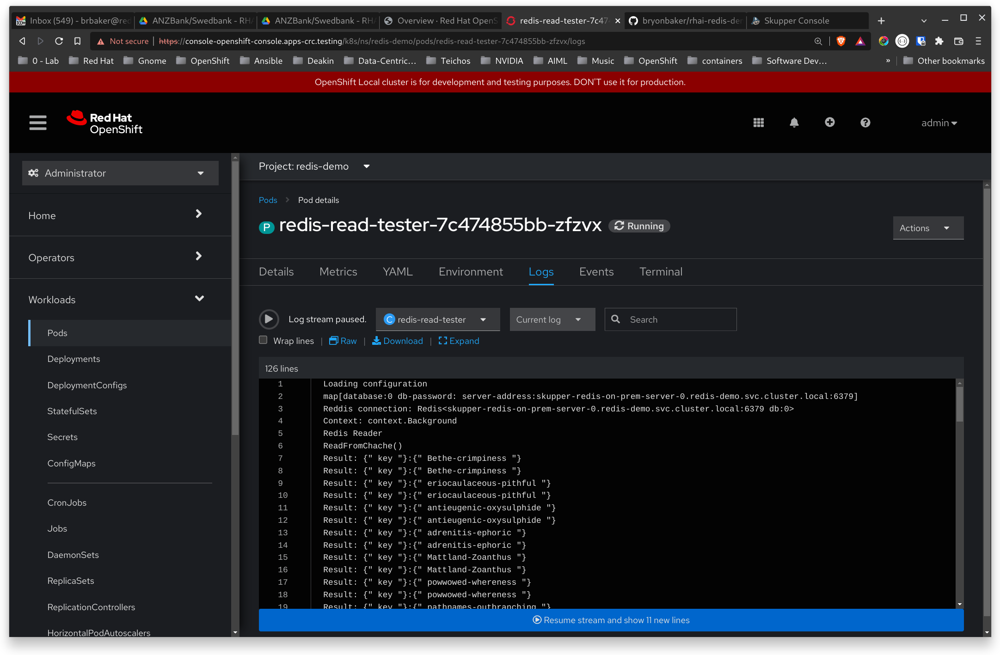
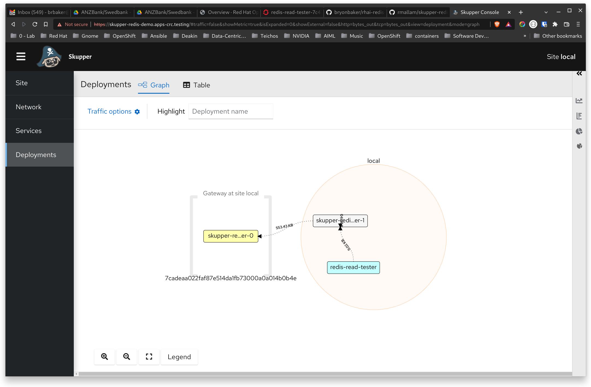
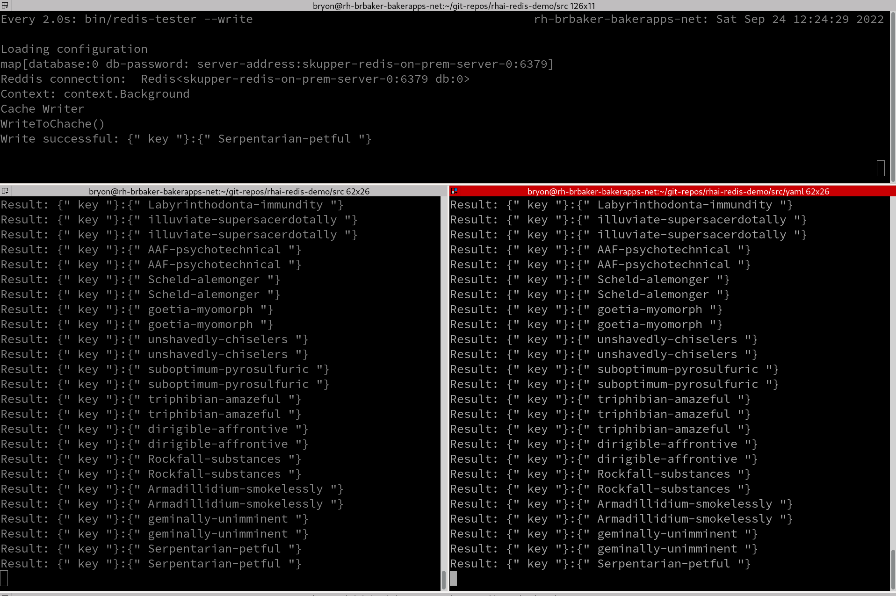
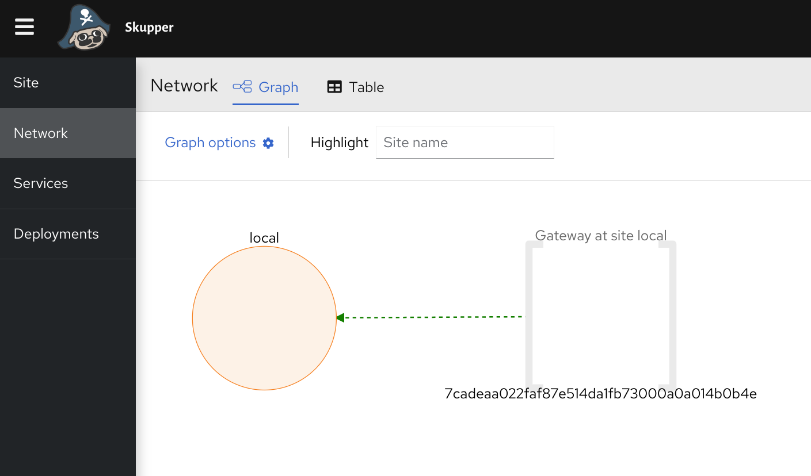
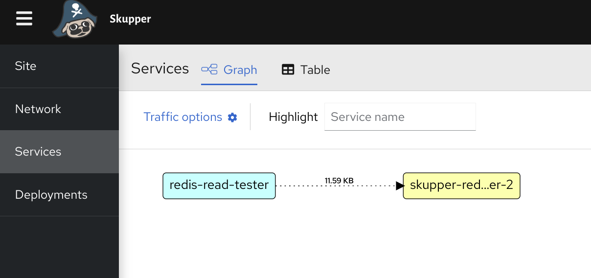
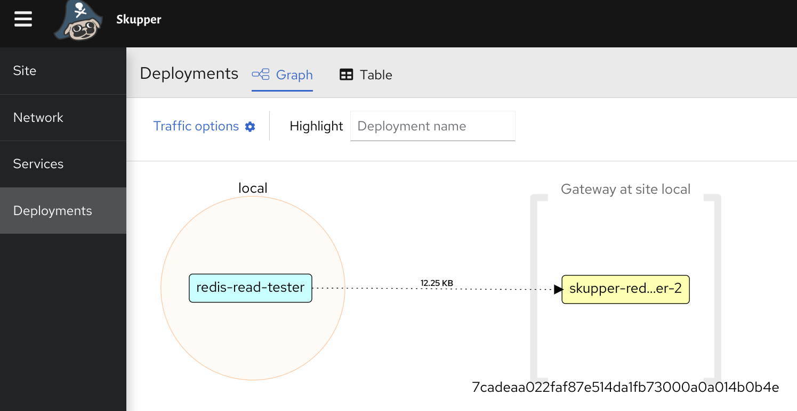

# Building a Global Redis Cache with OpenShift and Red Hat Applicationm Interconnect

## Background

The goal is to progressively extend an on-premises cache out to the cloud to create a global cache of readonly data.

This is a common pattern to protect core systems from Internet-scale workloads. A practical example in Banking and Finance is that over 90% of transactions from mobile devices are balance enquiries. Banks often set an SLA of an account balance being updated with 10 seconds of a transaction. So after a deposit, withdrawal, or transfer the mainframe updates the account balance in a strip file, and the new balance is written to a cache that is replicated close to all of the systems of engagement. As users enquire on their balance, their query is serviced locally and does not need to hit the mainframe - significantly reducing mainframe costs and protecting the mainframe from bursty workloads.

Building a globally-distributed cache with Redis and Kubernetes is traditionally difficult and complex because of Redis' requirement for TCP. To implement this without Application Interconnect you would need a global WAN and the use of NodePorts, Federated Service Mesh, or Submariner. All of which are complex to implement and manage at scale.

This demonstration illustrates how Application Interconnect simplifies aplication interconnectivity requirements, and enables progressive cloud migration of workloads.

The demonstration will use four OpenShift clusters:
* On-premises (OpenShift Local)
* Sydney (IBM Cloud)
* London (AWS)
* New York (AWS)

You will need a separate command ine environment for each cluster.  
**TODO: Update the instructions on setting up the isolated environments.**

## Story Arc

The story starts by using on-premises OpenShift to get your applciation cloud ready. 
* You will use Application Interconnect to provide a simple kubernetes-centric integration that will distribute the cache from traditional infrastructure to Kubernetes.
* Once the cache is successfully being replicated you will deploy a cache client on OpenShift. 
* Having successfully used OpenShift on-premises to get your application cloud ready, you will:
  * Extend the Application Interconnect network to OpenSHift running on IBM Cloud in Sydney.
  * Deploy a cache replica in Sydney
  * Deploy the cache reader in Sydney that uses the Sydney-based cache - thereby demonstrating how a sydney-based deployment is reading a local Redis cache that is being updated from within the data cantre.
* The demonstration repeats to add London and New York - thereby demonstrating a global Redis cache powered by an "OpenShift Fabric" and Red Hat Application Interconnect.

# Configure the Demo Environment
## Get this demo
If you havenot already, clone this git repository and change directory into the src directory
```
$ git clone https://github.com/bryonbaker/rhai-redis-demo
$ cd ./rhai-redis-demo/src
src$ 
```
**NOTE:** To illustrate the directory that you run commands from, the base directory will be included in the commands. E.g. ```src$ cd yaml``` describes running the ```cd``` command from the ```src``` directory.

The demonstration starts by demonstrating the initial application. It is two on-premises applications that share a cache. One writes to the cache (the mainframe), the other reads from the cache (the cache client).


First configure a workaround for resolving DNS hostnames from within a pod.

```
src$ sudo vi /etc/hosts
```
Add the following line to the end of the ```hosts``` file and save it:
```
127.0.0.1 skupper-redis-on-prem-server-0
```

## Start the Redis Server on Preimises

Start the Redis Cache in Podman. This is the on-premises Master Cache that all replicas are synchronised with.

```
src$ cd yaml
yaml$ podman play kube podman-redis.yaml
```

Podman launches the Redis cache and sentinel server in a Podman pod. Check the running state with ```podman ps```.
```
yaml$ podman ps
CONTAINER ID  IMAGE                                    COMMAND     CREATED             STATUS                 PORTS                                             NAMES
659e70e91727  localhost/podman-pause:4.2.0-1660228937              About a minute ago  Up About a minute ago  0.0.0.0:6379->6379/tcp, 0.0.0.0:26379->26379/tcp  7be728e5736e-infra
3cdc9ad23600  docker.io/library/redis:latest                       About a minute ago  Up About a minute ago  0.0.0.0:6379->6379/tcp, 0.0.0.0:26379->26379/tcp  redis-local-redis
b3008f5d8528  docker.io/library/redis:latest                       About a minute ago  Up About a minute ago  0.0.0.0:6379->6379/tcp, 0.0.0.0:26379->26379/tcp  redis-local-redis-sentinel
```

# Demonstration

The core environment setup is complete. The demonstration starts from here.

Open two terminal windows. Mainframe terminal is on the left, and the cient terminal is on the right.
Change in to the ```src``` directory in both terminals

In the Mainframe terminal type:
```
src$ watch bin/redis-tester --write
```
The cache will be updated every 2 seconds with a new entry.

In the Client terminal type:
```
src$ bin/redis-tester --read
```

You should now see the "Mainframe" updating the cache every two seconds, and the Client application reading the updated cache.



### Storyline
Here we are simulating a mainframe periodically writing to a cache, and an on-premises application retrieving the value from the cache. Because the client workload is based on customer activity, the load can be very "spikey". The use of a cache such as this is a common approach to protect the mainframe from unpredictable load and minimises mainframe costs.

### Demonstration Summary
1. First we will install Application Interconnect on On-Premises OpenShift, and then install a Gateway on the same machine that is running the on-premises master Redis cache.
2. Once the RHAI components are in place we will expose the on-premises cache to the OpenSHift cluster so Client applications can access the cache.
3. We will then refine this deployment to replicate the cache on OpenShift, and repoint the client application to use the cache replica.
4. By the end of ```step 3``` we will have used OpenmShift to get our application cloud ready and can how copy this deployment approach to create a globally-distributed cache with client applications able to access their local replica.


# Move the Reader to the On-Premises OpenShift

## Setup
1. Open a new terminal window. This will be dedicated to the "on-premises" steps.
Enter the following command. Note the additional period at the start (". ")
```
src$ . ./scripts/env-setup-local.sh
ON-PREM: src$
```
This will create a terminal session with its own kubeconfig.  Observe that the prompt changes to give you a visual clue as to which OpenShift cluster you are working with. This will allow you to have multiple logons to OpenShift clusters. We will refer to this terminal as the ``` ON-PREM``` terminal.

2. Log onto the OpenShift local.
3. Create a new project:
```
src$ oc new-project redis-demo
```

## Step 2: Install Skupper
```
$ LOCAL:$ skupper init --site-name local --console-auth=internal --console-user=admin --console-password=password

Skupper is now installed in namespace 'redis-demo'.  Use 'skupper status' to get more information.
```

The username:password (```admin:password```) will be used for logging on to the Application Interconnect console.

Get the routes from OpenShift:
```
ON-PREM: src$ oc get route/skupper
NAME      HOST/PORT                             PATH   SERVICES   PORT      TERMINATION          WILDCARD
skupper   skupper-redis-demo.apps-crc.testing          skupper    metrics   reencrypt/Redirect   None
ON-PREM: src$ 
```

Copy the route and paste it into the url of your browser. When prompted for logon credentials enter:
```
Username: admin
Password: password
```


### Create a Gateway to Publish the Redis Master to OpenShift

```
ON-PREM: src$skupper gateway expose skupper-redis-on-prem-server-0 127.0.0.1 6379 26379 --type podman

2022/09/24 11:04:59 CREATE io.skupper.router.tcpConnector rh-brbaker-bakerapps-net-bryon-egress-skupper-redis-on-prem-server-0:6379 map[address:skupper-redis-on-prem-server-0:6379 host:127.0.0.1 name:rh-brbaker-bakerapps-net-bryon-egress-skupper-redis-on-prem-server-0:6379 port:6379 siteId:92ed5d77-2b7c-4c7e-baab-3a09e88343c8]
2022/09/24 11:04:59 CREATE io.skupper.router.tcpConnector rh-brbaker-bakerapps-net-bryon-egress-skupper-redis-on-prem-server-0:26379 map[address:skupper-redis-on-prem-server-0:26379 host:127.0.0.1 name:rh-brbaker-bakerapps-net-bryon-egress-skupper-redis-on-prem-server-0:26379 port:26379 siteId:92ed5d77-2b7c-4c7e-baab-3a09e88343c8]
ON-PREM: src$
```

View the Gateway in the RHAI Console:



```
ON-PREM: src$ oc get svc,pods
NAME                                     TYPE        CLUSTER-IP     EXTERNAL-IP   PORT(S)               AGE
service/skupper                          ClusterIP   10.217.5.53    <none>        8080/TCP,8081/TCP     15m
service/skupper-redis-on-prem-server-0   ClusterIP   10.217.4.139   <none>        6379/TCP,26379/TCP    4m32s
service/skupper-router                   ClusterIP   10.217.5.84    <none>        55671/TCP,45671/TCP   15m
service/skupper-router-local             ClusterIP   10.217.5.56    <none>        5671/TCP              15m

NAME                                              READY   STATUS    RESTARTS   AGE
pod/skupper-router-b6f9947fd-pd89l                2/2     Running   0          15m
pod/skupper-service-controller-7cccd9467b-v9zgf   1/1     Running   0          15m
```

Observe that the Redis Master Cache is published as a service in the project, but there is no pod for the Redis Master. This is how RHAI creates a locationless application. It uses a Servicve Proxy and the RHAI Router routes requests to where the Service's implementation exists. Any call to the ```skupper-redis-on-prem-server-0``` service will be redirected via the Gateway to the cache running on premises.

## Deploy the Client Application to OpenShift

```
ON-PREM: src$ cd yaml
ON-PREM: yaml$  oc apply -f redis-reader-on-prem-dep.yaml 

configmap/redis-reader-on-prem-app-config created
Warning: would violate PodSecurity "restricted:v1.24": allowPrivilegeEscalation != false (container "redis-read-tester" must set securityContext.allowPrivilegeEscalation=false), unrestricted capabilities (container "redis-read-tester" must set securityContext.capabilities.drop=["ALL"]), runAsNonRoot != true (pod or container "redis-read-tester" must set securityContext.runAsNonRoot=true), seccompProfile (pod or container "redis-read-tester" must set securityContext.seccompProfile.type to "RuntimeDefault" or "Localhost")
deployment.apps/redis-read-tester created
```

Get a list of the running pods:
```
yaml$ oc get pods
NAME                                          READY   STATUS    RESTARTS   AGE
redis-read-tester-7c474855bb-zfzvx            1/1     Running   0          5m26s
skupper-router-b6f9947fd-pd89l                2/2     Running   0          30m
skupper-service-controller-7cccd9467b-v9zgf   1/1     Running   0          30m
```

Attach to the Redis pod and observe the cache updates:
```
yaml$ oc attach pod/redis-read-tester-7c474855bb-zfzvx
If you don't see a command prompt, try pressing enter.
Result: {" key "}:{" foreschool-Amye "}
Result: {" key "}:{" foreschool-Amye "}
Result: {" key "}:{" entrapment-pleuropericardial "}
```

View the deployment in the RHAI Console. Observe the Cient Application deployment is accessing the cache vie the Gateway.  


Open the On-Premises OpenSHift console and view the logs of the running Client Application. Scroll up on the logs and observe the server name for the cache is the on-premises cache:


At no point was a global DNS entry required, the Gateway is part of the RHAI application's network.

Find the pod running the reader
```
LOCAL: bryon@rh-brbaker-bakerapps-net:environment$ oc get pods
NAME                                          READY   STATUS    RESTARTS   AGE
redis-read-tester-694c59dfbc-lkww5            1/1     Running   0          94s
skupper-router-75bc9db8db-56nh5               2/2     Running   0          7m
skupper-service-controller-5496fcbc48-dtdpl   1/1     Running   0          6m58s
```

Attach to the pod and show the cache value is still the same

```
LOCAL: bryon@rh-brbaker-bakerapps-net:environment$ oc attach pod/redis-read-tester-694c59dfbc-lkww5
If you don't see a command prompt, try pressing enter.
Result: {" key "}:{" asbestoses-squiffer "}
Result: {" key "}:{" asbestoses-squiffer "}

```

## Set up the OpenShift Fabric

### Story Arc

One of the key value propositions of the Red Hat Open Hybrid cloud is the ability to create an "OpenShift Fabric" that ets you get your workloads 100% ready for the puiblic cloud, and then redeploy those workloads as is with only an endpoint configuration change.

In this section of the demonstration we will set up OpenShift on-premises as a true stepping stone for the public cloud deployments.

So far we have deployed the Client Application to on-premises OpenShift. Now we will create a cache replica on OpenShift. Once we have that we will be able to repeate the pattern of cache/appictaion deployment globally.

### Deploy Redis to OpenSHift On-Premises
```
ON-PREM: yaml$ oc apply -f redis-on-prem-ocp-dep.yaml 

deployment.apps/skupper-redis-server-1 created
configmap/skupper-redis-server-1 created
```

Attach to the TRedis pod and validate the cache is replicating:

```
ON-PREM: yaml$ oc get pods | grep skupper-redis
skupper-redis-server-1-6bb44b65b5-mfgbv       2/2     Running   0          3m35s


ON-PREM: yaml$ $ oc exec -it skupper-redis-server-1-6bb44b65b5-mfgbv -c redis -- /bin/bash
1000670000@skupper-redis-server-1-6bb44b65b5-mfgbv:/data$ 
```
Enter ```redis-cli get key``` and press ```Enter```. Observe the cache value changing:
```
1000670000@skupper-redis-server-1-6bb44b65b5-mfgbv:/data$ redis-cli get key
"viscousness-seagulls"
1000670000@skupper-redis-server-1-6bb44b65b5-mfgbv:/data$ redis-cli get key
"illocality-griffe"
1000670000@skupper-redis-server-1-6bb44b65b5-mfgbv:/data$
```

Press ```Ctrl-D``` to exit the running ocntainer
```
1000670000@skupper-redis-server-1-6bb44b65b5-mfgbv:/data$ 
exit
command terminated with exit code 130
ON-PREM: yaml$ 
```

### Expose the On-Premsies OpenShift Cache to the RHAI Network
View the current deployments and services
```
ON-PREM: yaml$ oc get deployment,svc
NAME                                         READY   UP-TO-DATE   AVAILABLE   AGE
deployment.apps/redis-read-tester            1/1     1            1           32m
deployment.apps/skupper-redis-server-1       1/1     1            1           9m59s
deployment.apps/skupper-router               1/1     1            1           58m
deployment.apps/skupper-service-controller   1/1     1            1           58m

NAME                                     TYPE        CLUSTER-IP     EXTERNAL-IP   PORT(S)               AGE
service/skupper                          ClusterIP   10.217.5.53    <none>        8080/TCP,8081/TCP     58m
service/skupper-redis-on-prem-server-0   ClusterIP   10.217.4.139   <none>        6379/TCP,26379/TCP    47m
service/skupper-router                   ClusterIP   10.217.5.84    <none>        55671/TCP,45671/TCP   58m
service/skupper-router-local             ClusterIP   10.217.5.56    <none>        5671/TCP              58m
```

We will now expose the ```skupper-redis-server-1``` deployment to the RHAI mesh network.

```
ON-PREM: yaml$ skupper expose deployment skupper-redis-server-1 --port 6379,26379

deployment skupper-redis-server-1 exposed as skupper-redis-server-1

ON-PREM: yaml$ oc get deployment,svc
NAME                                         READY   UP-TO-DATE   AVAILABLE   AGE
deployment.apps/redis-read-tester            1/1     1            1           37m
deployment.apps/skupper-redis-server-1       1/1     1            1           14m
deployment.apps/skupper-router               1/1     1            1           62m
deployment.apps/skupper-service-controller   1/1     1            1           62m

NAME                                     TYPE        CLUSTER-IP     EXTERNAL-IP   PORT(S)               AGE
service/skupper                          ClusterIP   10.217.5.53    <none>        8080/TCP,8081/TCP     62m
service/skupper-redis-on-prem-server-0   ClusterIP   10.217.4.139   <none>        6379/TCP,26379/TCP    51m
service/skupper-redis-server-1           ClusterIP   10.217.5.141   <none>        6379/TCP,26379/TCP    6s
service/skupper-router                   ClusterIP   10.217.5.84    <none>        55671/TCP,45671/TCP   62m
service/skupper-router-local             ClusterIP   10.217.5.56    <none>        5671/TCP              62m
```

Take a moment to view the network configuration in RHAI:
```
ON-PREM: yaml$ skupper network status
Sites:
╰─ [local] 5d1dc1b - local 
   URL: skupper-inter-router-redis-demo.apps-crc.testing
   mode: interior
   name: local
   namespace: redis-demo
   version: 1.0.2
   ╰─ Services:
      ├─ name: skupper-redis-on-prem-server-0
      │  address: skupper-redis-on-prem-server-0: 6379 26379
      │  protocol: tcp
      ╰─ name: skupper-redis-server-1
         address: skupper-redis-server-1: 6379 26379
         protocol: tcp
         ╰─ Targets:
            ├─ name: skupper-redis-server-1-6bb44b65b5-mfgbv
            ╰─ name: skupper-redis-server-1-6bb44b65b5-mfgbv
```

```
ON-PREM: yaml$ skupper gateway status
Gateway Definition:
╰─ rh-brbaker-bakerapps-net-bryon type:podman version:2.0.2
   ╰─ Bindings:
      ├─ skupper-redis-on-prem-server-0:6379 tcp skupper-redis-on-prem-server-0:6379 127.0.0.1 6379
      ╰─ skupper-redis-on-prem-server-0:26379 tcp skupper-redis-on-prem-server-0:26379 127.0.0.1 26379
ON-PREM: bryon@rh-brbaker-bakerapps-net:(main)yaml$ 
```

### Update the Application Client to use the new Cache Replica
```
$ oc edit cm/redis-reader-on-prem-app-config
```
Change the server addess property to be: ```server-address=skupper-redis-server-1:6379```.    

```
# Please edit the object below. Lines beginning with a '#' will be ignored,
# and an empty file will abort the edit. If an error occurs while saving this file will be
# reopened with the relevant failures.
#
apiVersion: v1
data:
  app-config.properties: |
    server-address=skupper-redis-server-1:6379
    db-password=
    database=0
kind: ConfigMap
metadata:
  annotations:
    kubectl.kubernetes.io/last-applied-configuration: |
      {"apiVersion":"v1","data":{"app-config.properties":"server-address=skupper-redis-on-prem-server-0.redis-demo.svc.cluster.local:6379\ndb-p>
  creationTimestamp: "2022-09-24T01:19:08Z"
  name: redis-reader-on-prem-app-config
  namespace: redis-demo
  resourceVersion: "833490"
  uid: e822134e-bd72-46d6-bc85-fa37a565e3e2
```
 Type Ctrl-X to save.

 We now need to force the running client to use the new replica. Delete the pod and wait for the new pod to spawn:
 ```
 ON-PREM: yaml$ oc get pods | grep redis-read
redis-read-tester-7c474855bb-zfzvx            1/1     Running   0          52m

ON-PREM: yaml$ oc delete pod/redis-read-tester-7c474855bb-zfzvx
pod "redis-read-tester-7c474855bb-zfzvx" deleted
ON-PREM: yaml$ oc get pods | grep redis-read
redis-read-tester-7c474855bb-czp42            1/1     Running   0          10s
```  
View the logs of the new read tester.

```
ON-PREM-yaml$ oc logs pod/redis-read-tester-7c474855bb-czp42

Loading configuration
map[database:0 db-password: server-address:skupper-redis-server-1:6379]
Reddis connection:  Redis<skupper-redis-server-1:6379 db:0>
Context: context.Background
Redis Reader
ReadFromChache()
Result: {" key "}:{" protozoologist-unscalloped "}
Result: {" key "}:{" twice-pursued-frush "}
Result: {" key "}:{" twice-pursued-frush "}
```

Scroll to the top and observe that the cache server is now: ```skupper-redis-server-1```

View the RHAI Console and observe the Client Application's connection is no longer to the Master cache.



Open the ON-PREM terminal and attach to view the cache reader logs:
```
ON-PREM: yaml$ oc attach pod/redis-read-tester-7c474855bb-czp42
If you don't see a command prompt, try pressing enter.
Result: {" key "}:{" ventriloqual-zealotical "}
Result: {" key "}:{" ventriloqual-zealotical "}
Result: {" key "}:{" overforward-temporarily "}
```
Leave this running as you will use this to compare the global cache replication later.

The following screen shot shows the "Mainframe", the logs from the original fat-client on-premises Application Client, and the Application CLient using the replicated cache on On-Premises OpemnShift. Observe how they are all in sync.



You will now leave the ON-PREM cluster.

## Migrate the Cache and Application to the Public Cloud

# *************************************

1. Create an IBM Console in a new terminal window
```
bryon@rh-brbaker-bakerapps-net:environment$ . ./env-setup-ibm.sh 
IBM-CLOUD: bryon@rh-brbaker-bakerapps-net:environment$
```

2. Deploy Skupper into the ```redis-demo``` project  
```
IBM-CLOUD:$ skupper init --site-name ibm-cloud --console-auth=internal --console-user=admin --console-password=password  

Skupper is now installed in namespace 'redis-demo'.  Use 'skupper status' to get more information.
```
3. Create a secure token
```
IBM-CLOUD:$  skupper token create --token-type cert ibm-cloud.yaml
Connection token written to ibm-cloud.yaml
```

4. Change to the LOCAL console
5. Import the secure token to establish the Skupper network

## View the Skupper Console

```
LOCAL:$ oc get route
NAME                   HOST/PORT                                          PATH   SERVICES         PORT           TERMINATION            WILDCARD
claims                 claims-redis-demo.apps-crc.testing                        skupper          claims         passthrough/Redirect   None
skupper                skupper-redis-demo.apps-crc.testing                       skupper          metrics        reencrypt/Redirect     None
skupper-edge           skupper-edge-redis-demo.apps-crc.testing                  skupper-router   edge           passthrough/None       None
skupper-inter-router   skupper-inter-router-redis-demo.apps-crc.testing          skupper-router   inter-router   passthrough/None       None
```

Your output may differ, but in this example the skupper router url is: ```skupper-redis-demo.apps-crc.testing```   

Open a browser with the url of the skupper router
The username is ```admin```. The password is ```password```.  








